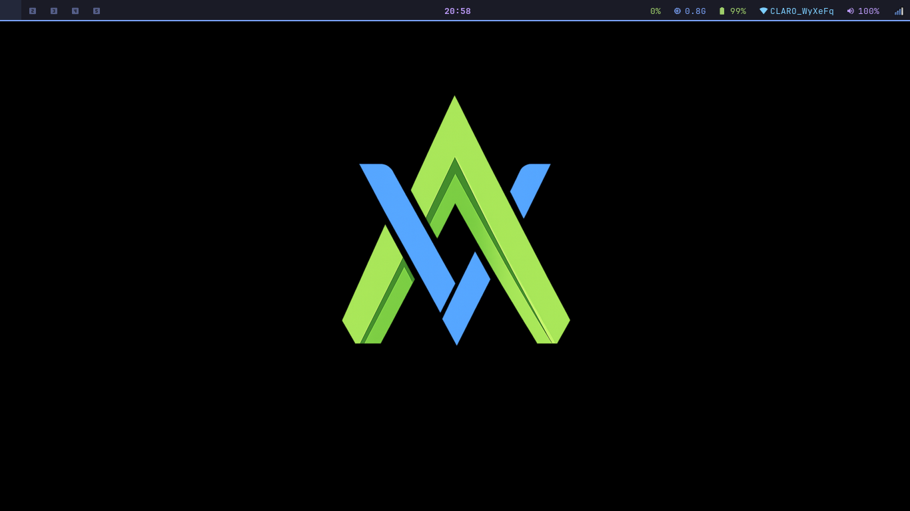
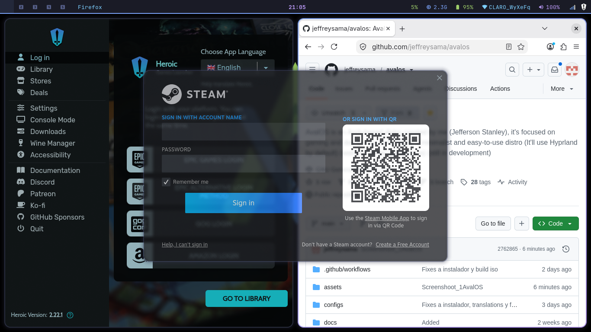

# AvalOS

**AvalOS** is a minimalist, beautiful, and high-performance Arch-based Linux distribution focused on **gaming** and **daily productivity**.

It ships with **Hyprland** (Wayland) as the default desktop environment, delivering a modern, lightweight, and highly customizable experience right out of the box.

---

## ✨ Features

- **Base**: Arch Linux (rolling release)
- **Desktop Environment**: Hyprland (Wayland)
- **Philosophy**: Minimalism, performance, and ease of use
- **Target Users**: Gamers, developers, and power users who want something clean and fast
- **Custom Kernel**: `linux-avalos` (optimized for desktop/gaming) + `linux-avalos-bore` and `linux-avalos-compat` variants
 - `linux-avalos-bore` uses the **BORE** scheduler (Burst-Oriented Response Enhancer) by [firelzrd](https://github.com/firelzrd/bore-scheduler), with adaptations from [CachyOS](https://github.com/CachyOS/kernel-patches)
- **Filesystem**: Btrfs with Snapper snapshots by default
- **Pre-configured Rice**: Beautiful and functional Hyprland + Waybar + Kitty + Rofi setup included
- **Extras**: ZRAM, BBR congestion control, carefully selected firmware (AMD/Intel only)

> **Note**: AvalOS currently supports **AMD and Intel** hardware only. NVIDIA is not supported, but could be possible (If you know how to install NVIDIA packages and all).

---

## 📸 Screenshots

---

## 📥 Installation

AvalOS ISOs are fully functional and ready for use.

> **Important**: The automatic installer is currently not working.  
> Please use the **manual installation** method.

### Quick steps

1. Download the latest ISO from the [Releases](https://github.com/jeffreysama/avalos/releases) page.
2. Flash it to a USB drive (Ventoy, Rufus, `dd`, or the included USB maker scripts).
3. Boot from the USB.
4. Follow the complete guide:

**→ [Manual Installation Guide](docs/INSTALL.md)**

The manual guide produces an installation that is functionally identical to what the automatic installer would create (Btrfs + Snapper layout, same package set, same configs, same kernel line, etc.).

---

## ⚠️ Current Status

AvalOS is under active development.

- ISOs work correctly for **manual installation**
- Automatic installer is not working currently while it is being fixed
- Only AMD and Intel GPUs are supported at this time

---

## 🛠️ System Highlights

- Custom optimized kernel line (`linux-avalos`)
- Btrfs with a clean 6-subvolume layout + Snapper + grub-btrfs
- ZRAM by default
- BBR + modern sysctl tuning
- Full Hyprland rice pre-configured (Hyprland, Waybar, Kitty, Rofi, Mako, SDDM theme, etc.)
- Ready for gaming (Steam, Wine, Proton-GE, Lutris, MangoHud, GameMode…)

---

## 🤝 Contributing

Issues, pull requests, and feedback are fully welcome!.

---

## License

**[License](LICENSE)**
